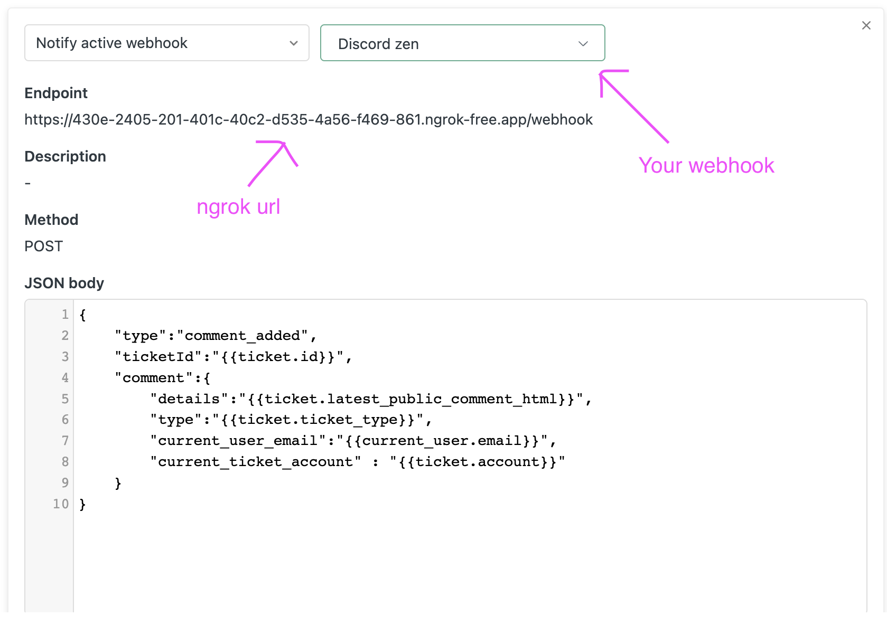
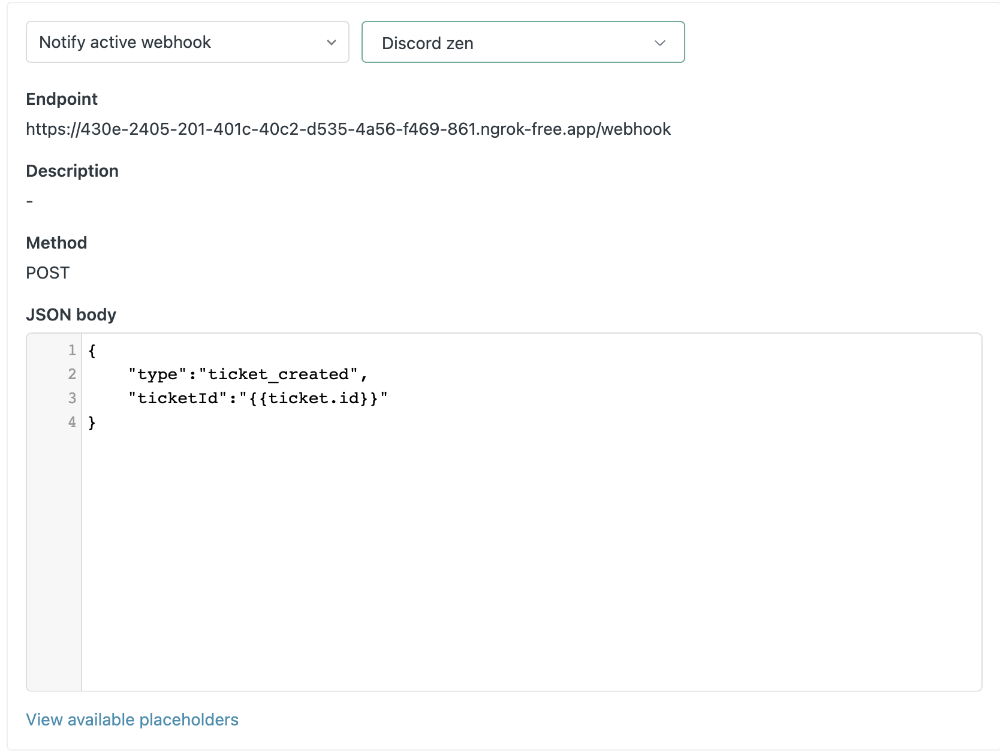

# ZenBot

A discord.js (v14.*+) bot to seamlessly integrate zendesk in your server


### Commands

#### `/zen`

* Fetches latest **50 tickets** having **new/open** status.
* every ticket has its own channel within a new category `zendesk` ( customizable ).

#### `/reset-zen`

* deletes all active ticket channles within `zendesk` category. archived tickets are not deleted.

### Features

#### Channel

* A channel having format `{zen-prefix}-{..params}-{id}` within `zendesk` category is considered a ticket channel.
* By default `zen-prefix` is `ticket` so the default channel name is `ticket-{id}` but its fully customisable.
* A ticket channel fetches all history for that ticket id from zendesk in the form of embeds.
* **Conversation inside the channel is happening in real time with the requester and updates the zendesk comments as well**.

#### Close Ticket

* Once done , you can close a ticket from the `Close` button.
* This will **set `close` status to zendesk ticket as well**. 
* The channel name will be updated to `{zen-close-prefix}-{...params}-{id}` where `zen-close-prefix` is customizable.

#### Archive

* Archived channels will be put in different category.
* They will not be deleted in `/reset-zen`.
* Reopeaning a ticket will send it back to main channel and **zendesk status will be set to `open`**.

#### Transcript

* Gives a **downloadable html transcript** of entire channel chat.

## Setup

### Discord.js

* Create a new bot from developer portal.
* copy the `TOKEN` and `CLIENT_ID` in .env.
* enable all gateway intents in Bot settings.
* Create an invite link using the Oauth2 URL generator
    * **select `application.commands` and `bot` as scopes** and set desired bot permissions. ( `admin` for full access )
* Once bot is in your server set `GUILD_ID` as this server's id in .env.

### Zendesk Portal

* Update your .env
    * `ZENDESK_EMAIL` : your zendesk email
    * `ZENDESK_PASSWORD` : your zendesk password
    * `API_BASE_URL` : you zendesk portal origin appended with /api ie `https://org.zendesk.com/api/v2`
    * `AGENT_EMAIL_SUFFIX` : if your zendesk email is `abc@org.com` then the suffix is `org`.

### Project
**Build - Dev**
```bash
yarn dev
```
**Build - Prod**
```bash
yarn start
```
**deploy commands**.
```bash
node ./deployment/deploy-commands.js
```
* by default the local PORT is `1234`.
* serve that port through ngrok to expose your local server globally.
* copy the ngrok https url. 

### Zendesk Webhooks

* Go to `/admin/apps-integrations/webhooks/webhooks/`
* Create a new webhook
    * **Select a way to connect** : Trigger or automation
    * Add the details
        * **Name** : give any name
        * **Endpoint URL** : `{your-ngrok-url}/webhook`
        * **Request method** : POST
        * **Request format** : JSON
        * **Authentication** : NONE ( you can add auth if u want to )
        * test the webhook out , it should hit the /webhook route handler.
    * connect the webhook.
* Now we have the webhook, lets add triggers to trigger it.
* Go to `/admin/objects-rules/rules/triggers` and click create trigger
* Create 2 new triggers

#### Ticket commented
* **Name** : Ticket commented
* Meet ANY of the following conditions :
    * Comment is Public
* **Actions**


#### Ticket created
* **Name** : Ticket created
* Meet ALL of the following conditions :
    * Ticket is Created
* **Actions**



### Enjoy !!

Once the webhooks are set , you can **run `/zen`** in your server and start using the bot.


## Contributing
Pull requests are welcome. For major changes, please open an issue first to discuss what you would like to change.

## License
[GNU General Public License v3.0](./LICENSE)


